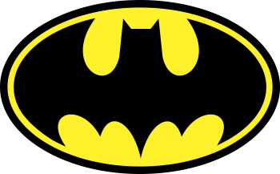

<div align="center">
  <a href="#">
      
  </a>

  <!-- project name -->
  <h1 align="center">Bat Signal App</h1>
  
  <!-- project badges -->
  <p align="center">
    
    
    
    
  </p> 

  <!-- project description and menu -->
  <p align="center">
      A React Native app inspired by Batman's Bat Signal, with a form to request help from the Dark Knight 🦇.
    <br />
    <a 
      href="## Usage">
      <strong>Go to usage now »</strong>
    </a>
    <br />
    <br />
    <a 
      href="https://github.com/rogerioaanjos/react-native-bat-signal/issues">
      Report Bug
    </a>
    ·
    <a 
      href="https://github.com/rogerioaanjos/react-native-bat-signal/issues/new">
      Request Feature
    </a>
  </p>
</div>

## Preview

<div align="center">
  <a href="#">
      
  </a>
</div>

## 🔥 Features
- [x] Custom navigation with Batman logo in the header;
- [x] Bat Signal screen with call to action;
- [x] Form screen with validation (name, phone, location, notes);
- [x] Custom back button returning to Home;
- [x] Success screen with Bat Signal animation.

## Technologies

This project was developed with the following technologies:

-   [React Native](https://reactnative.dev/)
-   [Expo](https://docs.expo.dev/)
-   [React Navigation](https://reactnavigation.org/)
-   [React Native Vector Icons](https://github.com/oblador/react-native-vector-icons)

## Building

You'll need [Node.js](https://nodejs.org) installed on your computer in order to build this app.

```bash
git clone https://github.com/rogerioanjosdev/react-native-bat-signal.git
$ cd react-native-bat-signal
$ npm install
$ npm run start
```

## Autor

| [<br><sub>Rogério Andrade</sub>](https://github.com/rogerioaanjos) |
| :---------------------------------------------------------------------------------------------------------------------------------------: |
|                                             [Linkedin](https://www.linkedin.com/in/rogerioaanjos/)                                             |